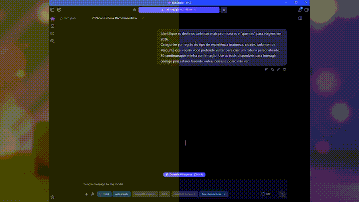

# FlowStep - MCP Server for User Interactions


# 🚧 **Under Development**

A complete Model Context Protocol (MCP) server designed to facilitate seamless interaction between Large Language Models (LLMs) and end-users. It provides a robust set of tools for notifications, confirmations, selections, and text inputs, supporting multiple rendering modes including Console, GUI, and Telegram Bot.

## 🎯 Native Desktop UI
[▶️ Watch the demonstration video](assets/StepFlowMCP.mp4)



## 🎯 Telegram UI
[▶️ Watch the demonstration video](assets/StepFlowMCP-telegram.mp4)


## 🎯 Overview

FlowStep acts as an abstraction layer for user interactions. It exposes standard MCP tools that LLMs can invoke to interact with the user based on the application's configuration (Console, GUI, or Telegram).

**Key Capabilities:**
*   **Notifications**: Display non-blocking or blocking informational messages.
*   **Confirmations**: Request explicit Yes/No or Cancel confirmation from the user.
*   **Single & Multi-Selection**: Provide dropdowns or lists for choosing one or multiple options.
*   **Text Input**: Collect free-form text from the user with multi-line support.
*   **Custom Input**: Allow selection from a predefined list *or* custom text entry.
*   **Progress Reporting**: Visual feedback for long-running operations.
*   **Multiple Render Modes**: Console (CLI), Desktop GUI (Avalonia), or Telegram Bot.

## 📦 Project Structure

The library is organized into logical layers:

```
FlowStep.MCP.Library/
├── Models/
│   └── InteractionModels.cs           # Data models (InteractionRequest, InteractionResponse, InteractionOption)
├── Contracts/
│   ├── IFlowStepService.cs            # Core service interface
│   └── IInteractionRenderer.cs        # Renderer interface (Contracts for UI implementation)
├── Services/
│   └── FlowStepService.cs             # Business logic and orchestration
├── McpServices/
│   └── FlowStepMcpService.cs          # Implementation of MCP Server Tools
├── Renderers/
│   ├── CliInteractionRenderer.cs      # Console-based implementation
│   ├── TelegramRenderer.cs            # Telegram Bot implementation
│   ├── GuiInteractionBridge.cs        # Bridge for custom GUI implementations
│   └── AvaloniaUI/
│       ├── AvaloniaUIRenderer.cs      # Main Avalonia GUI renderer
│       ├── Themes/
│       │   └── ThemeColors.cs         # Dark mode color definitions
│       ├── Header/
│       │   └── HeaderContentFactory.cs
│       ├── Footer/
│       │   ├── StandardFooterFactory.cs
│       │   └── NotificationFooterFactory.cs
│       ├── Inputs/
│       │   ├── SingleChoiceInputFactory.cs
│       │   ├── MultiChoiceInputFactory.cs
│       │   ├── TextInputFactory.cs
│       │   └── ChoiceWithTextInputFactory.cs
│       ├── Factories/
│       │   ├── ConfirmationButtonsFactory.cs
│       │   ├── SimpleConfirmationContentFactory.cs
│       │   └── ResponseBuilder.cs
│       └── Styles/
│           └── DarkThemeStyles.cs     # XAML-like styling logic
├── Extensions/
│   └── FlowStepServiceExtension.cs    # DI Registration helper
└── FlowStep.MCP.Library.csproj
```

## 🖥️ Rendering Modes

FlowStep supports three rendering modes, configurable at startup:

| Mode | Description | Use Case |
|------|-------------|----------|
| **CLI** | Console/Terminal interface | Headless servers, debugging, automation scripts |
| **GUI** | Avalonia Desktop application | Rich desktop experience with modern dark UI |
| **Telegram** | Telegram Bot integration | Remote interactions, mobile notifications, distributed teams |

### Mode Selection Priority

Configuration is resolved in the following order (highest to lowest priority):

1. **Command Line Arguments**
2. **Environment Variables** (prefix: `FLOWSTEP_`)
3. **appsettings.json**
4. **Default** (GUI)

## ⚙️ Configuration

### Command Line Arguments

```bash
# GUI Mode (default)
dotnet run

# CLI Mode
dotnet run -- --mode cli

# Telegram Mode
dotnet run -- --mode telegram --telegram-token "123456:ABC-DEF" --telegram-chat-id 123456789

# Custom configuration file
dotnet run -- --config /path/to/custom-config.json
```

### Environment Variables

```bash
# Windows
set FLOWSTEP_MODE=telegram
set FLOWSTEP_TELEGRAM__BOTTOKEN=123456:ABC-DEF
set FLOWSTEP_TELEGRAM__CHATID=123456789

# Linux/Mac
export FLOWSTEP_MODE=telegram
export FLOWSTEP_TELEGRAM__BOTTOKEN=123456:ABC-DEF
export FLOWSTEP_TELEGRAM__CHATID=123456789
```

### appsettings.json

```json
{
  "Logging": {
    "LogLevel": {
      "Default": "Information",
      "Microsoft.AspNetCore": "Warning"
    }
  },
  "AllowedHosts": "*",
  "Mode": "gui",
  "Telegram": {
    "BotToken": "123456:ABC-DEF",
    "ChatId": "123456789"
  }
}
```

### Environment-Specific Configuration

Create `appsettings.Development.json` or `appsettings.Production.json` for environment-specific overrides:

```json
{
  "Mode": "cli",
  "Logging": {
    "LogLevel": {
      "Default": "Debug"
    }
  }
}
```

## 🌐 MCP Client Configuration

To integrate FlowStep with your favorite AI editor or client (e.g., **Cursor, Windsurf, Claude Desktop**, or **Cline**), add the server configuration to your client's settings.

### HTTP Transport (Recommended)

```json
{
  "mcpServers": {
    "FlowStep.MCP": {
      "url": "http://localhost:59170"
    }
  }
}
```

### STDIO Transport (Local Execution)

```json
{
  "mcpServers": {
    "FlowStep.MCP": {
      "command": "dotnet",
      "args": [
        "run",
        "--project",
        "src/FlowStep.MCP/FlowStep.MCP.csproj",
        "--",
        "--mode",
        "gui"
      ]
    }
  }
}
```

## 🛠️ MCP Tools Reference

All tools are exposed via the `FlowStepMcpService` and automatically registered with the MCP server.

### 1. NotifyUserAsync
Displays a simple notification to the user with a title and message.

*   **Parameters**:
    *   `message` (string): Message to be displayed to the user.
    *   `title` (string): Notification title (optional; default: 'System').
    *   `waitConfirmation` (bool): If true, waits for user confirmation. Default: false.
*   **Returns**: Status of the operation.

### 2. ConfirmAsync
Requests user confirmation with a message.

*   **Parameters**:
    *   `message` (string): Confirmation message to the user.
    *   `title` (string): Confirmation title (optional).
    *   `isCancellable` (bool): Indicates whether the operation can be cancelled (optional; default: true).
*   **Returns**: "yes", "no", or "cancelled".

### 3. ChooseOptionAsync
Allows the user to choose one option among several available ones.

*   **Parameters**:
    *   `message` (string): Message describing the available options.
    *   `options` (List<InteractionOption>): List of options available for selection.
    *   `title` (string): Title of the choice (optional).
    *   `allowCustomInput` (bool): Whether to allow a custom input option (optional; default: false).
*   **Returns**: Value of the selected option or "custom:{value}" if custom input is provided.

### 4. ChooseMultipleOptionsAsync
Allows the user to select multiple options.

*   **Parameters**:
    *   `title` (string): Title of the selection (optional).
    *   `message` (string): Message describing the available options.
    *   `options` (List<InteractionOption>): List of options available for selection.
    *   `minSelections` (int): Minimum number of required selections (optional; default: 0).
    *   `maxSelections` (int): Maximum number of allowed selections (optional; default: 1).
*   **Returns**: List of values of selected options.

### 5. AskUserForTextAsync
Requests that the user type free-form text. Supports multi-line input in GUI mode.

*   **Parameters**:
    *   `message` (string): Instruction or message to the user.
    *   `title` (string): Title of the text field (optional).
    *   `placeholder` (string): Placeholder text shown in the input field (optional; default: 'Type here...').
*   **Returns**: The text entered by the user (may contain line breaks).

### 6. ChooseWithCustomTextAsync
Allows the user to choose one option and optionally type a custom text.

*   **Parameters**:
    *   `message` (string): Instruction message for the user.
    *   `options` (List<InteractionOption>): List of options available for selection.
    *   `title` (string): Title of the interaction (optional).
    *   `placeholder` (string): Placeholder text for the custom text input field (optional).
*   **Returns**: Selected option value or custom text prefixed with "custom:".

### 7. ShowProgressAsync
Displays a notification indicating the progress of an operation.

*   **Parameters**:
    *   `operationName` (string): Descriptive name of the ongoing operation.
    *   `total` (int): Total number of items to process.
    *   `status` (string): Current status or progress message.
*   **Returns**: Status of the operation.

## 🎨 Interaction Types

The library handles six distinct interaction types defined in `InteractionType`:

1.  **Notification**: Simple display (OK).
2.  **Confirmation**: Yes/No decision.
3.  **SingleChoice**: Dropdown / Radio (Select 1).
4.  **MultiChoice**: Checkboxes (Select N).
5.  **TextInput**: Multi-line text input with word wrapping.
6.  **ChoiceWithText**: Predefined options + Custom text field.

## 🏗️ Architecture

*   **Service Layer**: `FlowStepService` handles orchestration and timeout management.
*   **Renderer Layer**: `IInteractionRenderer` defines the contract. Implementations include:
    *   `CliInteractionRenderer`: Terminal/console interface
    *   `AvaloniaUIRenderer`: Modern desktop GUI with dark theme
    *   `TelegramRenderer`: Telegram Bot API integration
*   **MCP Layer**: `FlowStepMcpService` exposes tools conforming to the Model Context Protocol.

## 🚀 Getting Started

### Prerequisites

- .NET 10.0 SDK
- (Optional) Telegram Bot Token for Telegram mode

### Running in GUI Mode (Default)

```bash
dotnet run --project src/FlowStep.MCP/FlowStep.MCP.csproj
```

### Running in CLI Mode

```bash
dotnet run --project src/FlowStep.MCP/FlowStep.MCP.csproj -- --mode cli
```

### Running in Telegram Mode

```bash
# Via arguments
dotnet run --project src/FlowStep.MCP/FlowStep.MCP.csproj -- --mode telegram --telegram-token "YOUR_TOKEN" --telegram-chat-id 123456789

# Via environment
export FLOWSTEP_MODE=telegram
export FLOWSTEP_TELEGRAM__BOTTOKEN="YOUR_TOKEN"
export FLOWSTEP_TELEGRAM__CHATID=123456789
dotnet run --project src/FlowStep.MCP/FlowStep.MCP.csproj
```

## License

This project is licensed under the MIT License - see the [LICENSE](LICENSE) file for details.

<p align="center">Made with ❤️</p>
